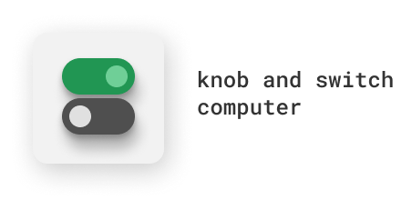

# Knob and Switch computer in DrRacket

This is a Racket implementation of the [Knob and Switch computer](https://www.inf.usi.ch/faculty/langheinrich/edu/KandS2/) we have known
during the CA course.

The Knob & Switch Computer uses an intuitive metaphor and an interactive approach to introduce
introductory CS students to the big ideas in computer organization.

## Team

* Bevilacqua Joey
* Brunner Nicola

## Documentation

The documentation is available in the [docs folder](docs/README.md).

## Roadmap

### Completed

1. Create a graphical user interface using **racket/gui**
2. Implement the basic Datapath which includes the Buses, Registers and Switches
3. Full-cycle and per-step execution
4. Memory support (and visualization)
5. MicroInstructions interpreter to execute a MicroProgram from a given file
6. Decouple functional part from obj-oriented using a world abstraction
7. Custom microprogram execution
8. Documentation

### To do
