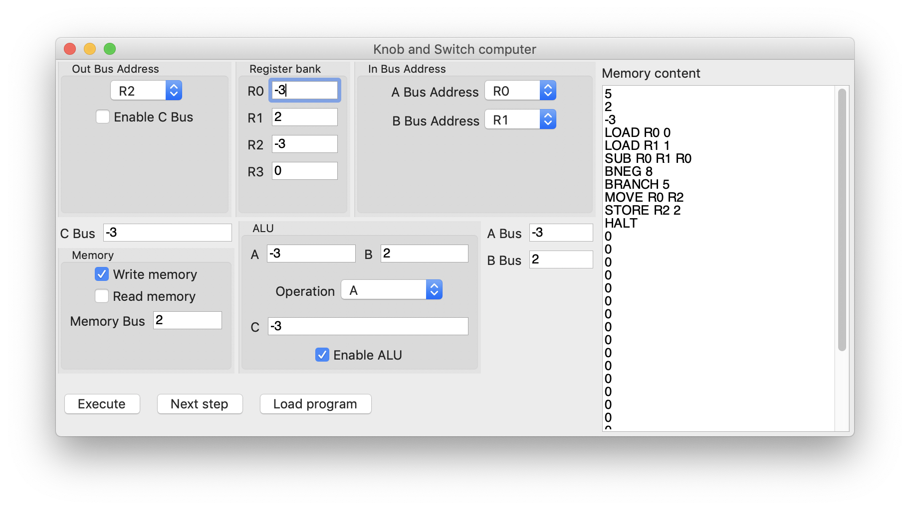
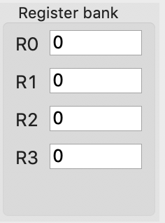
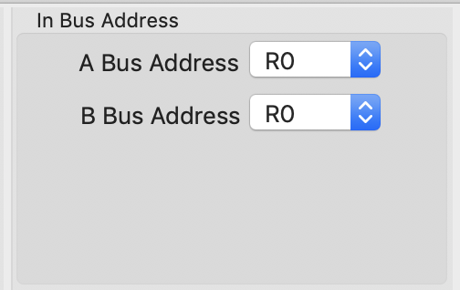
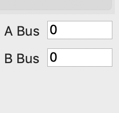
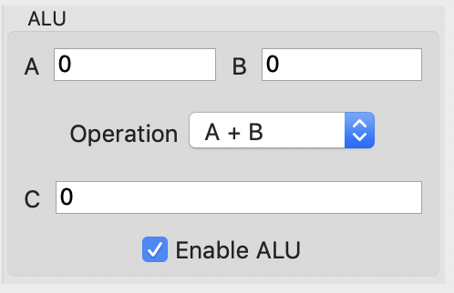
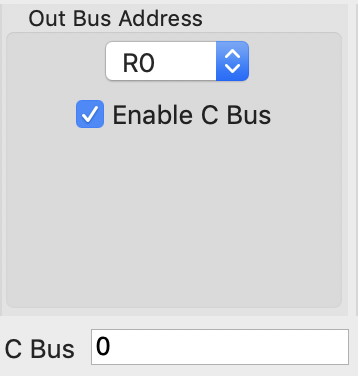
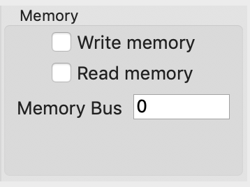
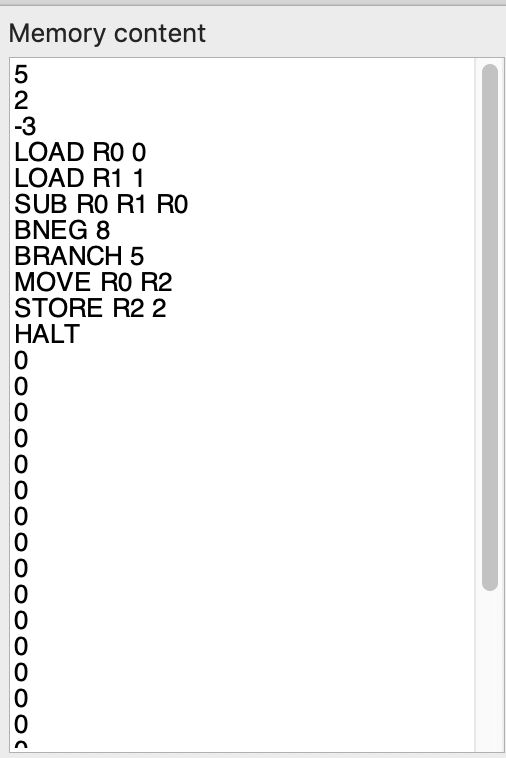
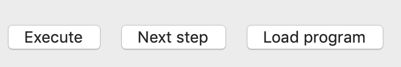

# K&S computer documentation

## Table of contents

* [Getting started](#getting-started)
  * [Register bank](#register-bank)
  * [Input buses](#input-buses)
  * [ALU](#alu)
  * [Output bus](#output-bus)
  * [Memory](#memory)
    * [Memory bus](#memory-bus)
    * [Memory content](#memory-content)
 * [Buttons](#buttons)
* [Writing a microprogram](#writing-a-microprogram)
  * [Supported microinstructions](#supported-microinstructions)
* [Running a microprogram](#running-a-microprogram)
* [Compiling](#compiling)

## Getting started

[](#getting-started)

Once opened, the program displays the graphical user interface
that can be used to operate with the machine.

Let's explore each component:

### Register bank

[](#register-bank)

There are 4 registers that can hold numeric values. These registers can both be read and written.

### Input buses

[](#input-buses)
[](#input-buses)

The input buses address _knobs_ (**A** and **B**) are used to select a register address (from 0
to 3) which will be read.

During the execution of a cycle, the **A** and **B** buses will acquire the value of the selected
register. These 2 values will eventually be passed to the ALU.

### ALU

[](#alu)

The Arithmetic Logic Unit is responsible for doing some arithmetic operations. Given the inputs
**A** and **B**, the supported operations are:

* A + B (addition)
* A - B (subtraction)
* A or B (bitwise or)
* A and B (bitwise and)
* A (return the first input value)

The ALU can be disabled using the relative _switch_ if it's not required / desired in
one or more specific cycle(s).

The output will be placed into the **C** bus.

### Output bus

[](#output-bus)

The **C** bus has multiple purposes:

* Carry the output of the ALU to a register specified in the **C** bus address _knob_
* Carry the output of the ALU to the memory
* Carry the value read from the memory to a register specified in the **C** bus address _knob_

2 of these operations can be run at the same assuming they don't conflict (eg.
writing to memory and register at the same time is allowed).
Note that in some cases it may be needed to disable the address selector through the
relative _switch_ to accomplish the given operation.

### Memory

#### Memory bus

[](#memory-bus)

The memory bus interacts with the **C** bus to read and write data to the memory.
The **read** and **write** _switches_ can be toggled to specify the direction of the data
flow.

#### Memory content

[](#memory-content)

On the right it's possible to see the memory content. This is used when loading a microprogram
into the memory as it will display both the instructions and data used.
It's also updated during the execution of the program when running I/O operations.


### Buttons

[](#buttons)

* Execute: the machine will perform a full cycle with the current settings
* Next step: the machine will perform just one step of a cycle with the current settings
* Load program: the machine will reset, load and execute a given microprogram

## Writing a microprogram

It's possible to write **microprograms** using a set of available **microinstructions** to run
programs using the knob and switch computer.

To write a microprogram that can be loaded into the K&S computer you need to create a **.csv** file
with this exact structure:

```
[Executable bit],[Data or Instruction]
```

Where

* **[Executable bit]** is `0` or `1` (marks whether the given memory position contains data or instructions)
* **[Data]** is an integer number that can be later read in the program
* **[Instruction]** is a string containing an instruction that will be parsed and executed

### Supported microinstructions

| Instruction           | Example      | Description                                                                        |
| --------------------- | ------------ | ---------------------------------------------------------------------------------- |
| LOAD REG MEM          | LOAD R0 2    | Load the value of MEM from the memory to the register REG                          |
| STORE REG MEM         | STORE R1 5   | Store the value of REG to the value MEM in the memory                              |
| MOVE REG-A REG-B      | MOVE R3 R2   | Move the value of REG-A to REG-B                                                   |
| ADD REG-A REG-B REG-C | ADD R0 R1 R2 | Sum the value of REG-A and REG-B, store the result in REG-C                        |
| SUB REG-A REG-B REG-C | SUB R4 R3 R0 | Subtract the value of REG-B from REG-A, store the result in REG-C                  |
| AND REG-A REG-B REG-C | AND R1 R2 R3 | Bitwise AND the value of REG-A and REG-B, store the result in REG-C                |
| OR REG-A REG-B REG-C  | OR R2 R3 R4  | Bitwise OR the value of REG-A and REG-B, store the result in REG-C                 |
| BRANCH PC             | BRANCH 12    | Branch the execution unconditionally to the PC memory position                     |
| BZERO PC              | BZERO 8      | Branch the execution to the PC memory position if the last ALU result was 0        |
| BNEG PC               | BNEG 3       | Branch the execution to the PC memory position if the last ALU result was negative |
| NOP                   | NOP          | Do nothing                                                                         |
| HALT                  | HALT         | Stop the execution of the microprogram                                             |

## Running a microprogram

To run a microprogram, click on the **Load program** button on the bottom and select the
**.csv** file you want to execute.


## Compiling

It's possible to compile this program using [raco](https://docs.racket-lang.org/raco/):

```
raco exe --gui --ico res/icon.ico --icns res/icon.icns --embed-dlls ++lang racket/gui main.rkt
```
